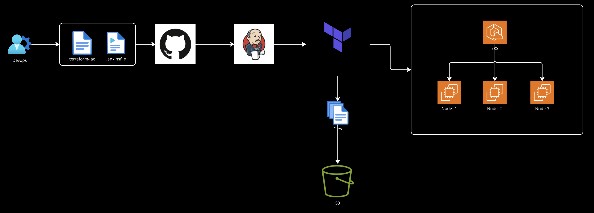

#################################
Infrastructure Overview
#################################
The infrastructure is defined using Terraform and consists of the following components:

Amazon EKS (Elastic Kubernetes Service): A managed Kubernetes service to run the chatbot application.
Amazon VPC (Virtual Private Cloud): A dedicated and isolated virtual network for the EKS cluster.
Public Subnets: Two public subnets are created for the EKS worker nodes.
Internet Gateway: Provides internet access to the subnets.
Route Table: Routes traffic from the subnets to the internet.
Security Groups: Control inbound and outbound traffic to the EKS cluster and worker nodes.
IAM Roles: IAM roles are defined for the EKS cluster and worker nodes to provide the necessary permissions to interact with other AWS services.
#################################
CI/CD Pipeline
#################################
A Jenkins pipeline is used to automate the deployment of the infrastructure. The pipeline is defined in the Jenkinsfile and consists of the following stages:

Checkout: The pipeline checks out the source code from the GitHub repository.
Plan: It runs terraform plan to create an execution plan for the infrastructure changes.
Approval: The pipeline waits for manual approval before applying any changes. This allows for a review of the plan before it is executed.
Apply or Destroy: Based on the user's choice, the pipeline either applies the changes using terraform apply or destroys the infrastructure using terraform destroy.
Backup-Stage: After applying the changes, the pipeline backs up the terraform.tfstate file to an S3 bucket. This is crucial for disaster recovery and for managing the state of the infrastructure.
#################################
Use Cases
#################################
This infrastructure is designed to support the following use cases:

Development and Testing: The infrastructure can be quickly provisioned to create a development or testing environment for the chatbot application. The terraform apply and terraform destroy commands, automated by the Jenkins pipeline, make it easy to create and tear down the environment as needed.
Staging: A staging environment can be created to test new features and bug fixes before they are deployed to production. This environment would be a replica of the production environment.
Production: The infrastructure is robust enough to be used for a production deployment of the chatbot. The EKS cluster can be scaled to handle a large number of users.
Disaster Recovery: The backup of the Terraform state to S3 allows for quick recovery in case of a disaster. The entire infrastructure can be recreated from the state file.
Scalability: The EKS node group is configured with a scaling policy that allows it to automatically scale up or down based on the load. This ensures that the application is always available and responsive.
#################################
Real-Time Use Cases
#################################
E-commerce Chatbot: An EKS-based chatbot can be used to provide customer support, answer product questions, and even process orders. The scalability of EKS ensures that the chatbot can handle a high volume of concurrent users during peak shopping seasons.
Food Delivery App: A chatbot can be used to take orders, track deliveries, and answer customer queries. EKS can be used to deploy the chatbot and its backend services, ensuring high availability and low latency.
Healthcare Chatbot: A chatbot can be used to provide patients with information about their health, schedule appointments, and answer frequently asked questions. EKS provides a secure and compliant platform for hosting healthcare applications.
Financial Services Chatbot: A chatbot can be used to provide customers with information about their accounts, make payments, and get financial advice. EKS can be used to deploy the chatbot in a secure and compliant manner.
Interview Questions
#################################
Terraform:
#################################
What is Terraform and why is it used?
What is the difference between terraform plan and terraform apply?
What is a Terraform provider?
What is a Terraform module?
How do you manage secrets in Terraform?
What is the purpose of the terraform.tfstate file?
How do you manage remote state in Terraform?
#################################
Kubernetes:
#################################
What is Kubernetes and why is it used?
What is a Pod in Kubernetes?
What is a Deployment in Kubernetes?
What is a Service in Kubernetes?
What is a Namespace in Kubernetes?
How do you scale an application in Kubernetes?
How do you manage secrets in Kubernetes?
#################################
Jenkins:
#################################

What is Jenkins and why is it used?
What is a Jenkins pipeline?
What is a Jenkinsfile?
What is a Jenkins agent?
How do you manage credentials in Jenkins?
#################################
Resume you can mention the Points
#################################
Experience in provisioning and managing cloud infrastructure using Terraform.
Hands-on experience with container orchestration using Kubernetes (EKS).
Proficient in setting up and managing CI/CD pipelines using Jenkins.
Experience in deploying and managing applications on AWS.
Strong understanding of cloud networking and security concepts.
Experience with monitoring and logging tools such as Prometheus, Grafana, and ELK.